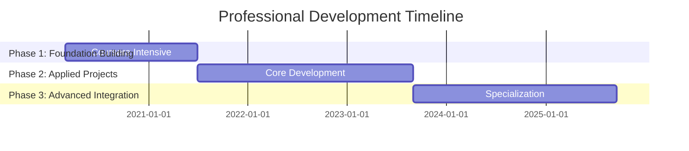

# Patrick Carlberg - Data Science Learning Journey (2019–2025)

## 🎯 Transforming Career Uncertainty into Technical Excellence

After completing my formal employment in August 2019, I made a strategic decision to invest in comprehensive professional development. Rather than rushing into the next role, I transformed this period into an intensive learning journey focused on modern data science, cloud technologies, and advanced analytics – skills I recognized as critical for the future of semiconductor manufacturing and data-driven innovation.

---

## 📈 Learning Journey Overview



### 🏗️ **Phase 1: Foundation Building** (2020-2021)
**Strategic Skills Acquisition Through Rigorous Coursework**

During this intensive learning phase, I completed **40+ professional certifications** from leading institutions, establishing a robust foundation in modern data science technologies. This wasn't casual learning – it was a deliberate, full-time commitment to mastering the technical skills required for senior data science roles.

**Key Certifications Completed:**
- **Google Cloud Specializations** (11 courses) - Machine Learning, Big Data, Cloud Architecture
- **TensorFlow 2 for Deep Learning** (Imperial College London)
- **Applied Data Science with Python** (University of Michigan)
- **Statistics with Python** (University of Michigan)
- **Machine Learning for Trading** (New York Institute of Finance)
- **Modern Big Data Analysis with SQL** (Cloudera)

*[View complete certification list →](coursera_certificates.md)*

### 🔨 **Phase 2: Applied Development** (2021-2023)
**From Theory to Implementation**

Armed with foundational knowledge, I began building increasingly sophisticated projects, each designed to solve real-world challenges while mastering specific technology stacks. This phase demonstrates the practical application of my learning through hands-on development.

## 🚀 Technology Progression Visualization

### **Deep Learning & AI Frameworks**
```
2021 ████████████████████████████████████████ TensorFlow Foundations
2022 ████████████████████████████████████████ PyTorch Deep Dive
2024 ████████████████████████████████████████ Advanced RNNs & GANs
2025 ████████████████████████████████████████ LangChain & Gen AI
```
**Progression:** TensorFlow basics → PyTorch mastery → Advanced architectures → Generative AI

### **Web APIs & Deployment**
```
2021 ████████████████████████████████████████ Flask Foundations
2022 ████████████████████████████████████████ FastAPI Development
2023 ████████████████████████████████████████ Microservices & Auth
2024 ████████████████████████████████████████ Production Deployment
```
**Progression:** Simple Flask apps → FastAPI mastery → Security & microservices → Production systems

### **Big Data & Analytics**
```
2021 ████████████████████████████████████████ XGBoost & MLflow
2022 ████████████████████████████████████████ 28GB Dataset Processing
2023 ████████████████████████████████████████ Time Series at Scale
2024 ████████████████████████████████████████ Advanced Forecasting
```
**Progression:** Standard ML → Large-scale processing → Time series expertise → Advanced analytics

### **Advanced Computing**
```
2022 ████████████████████████████████████████ GPU Programming
2023 ████████████████████████████████████████ CUDA Optimization
2024 ████████████████████████████████████████ Parallel Processing
2025 ████████████████████████████████████████ High-Performance ML
```
**Progression:** Basic GPU usage → CUDA programming → Optimization → Production HPC

---

## 🎯 **Phase 3: Specialization & Integration** (2023-Present)
**Advanced Applications & Modern Technologies**

The final phase focuses on cutting-edge technologies and sophisticated applications, including generative AI, advanced time series forecasting, and production-ready ML systems. This demonstrates my ability to adapt to rapidly evolving technology landscapes.

**Recent Highlights:**
- **LangChain & RAG Systems** (2025): Advanced conversational AI implementations
- **Kaggle Competitions** (2024-2025): Consistent participation in challenging ML competitions
- **Production ML Serving** (2025): FastAPI + monitoring with Grafana/Prometheus
- **Time Series Mastery** (2024): Advanced forecasting with modern Python libraries

---

## 📊 Key Project Milestones

| Year | **Breakthrough Project** | **Technology Focus** | **Business Impact** |
|------|--------------------------|---------------------|---------------------|
| 2021 | Million Song Database ML | XGBoost + Flask deployment | Scalable ML serving |
| 2022 | 28GB CitiBike Analytics | Big Data processing | Large-scale data handling |
| 2023 | Singapore Rental Analytics | Web scraping + FastAPI | Real-world data application |
| 2024 | Advanced Time Series | Multi-variate forecasting | Predictive analytics mastery |
| 2025 | RAG Chat Systems | LangChain + Gen AI | Modern AI integration |

---

## 💼 Professional Value Proposition

This intensive learning journey has equipped me with:

- **Modern Technology Stack**: Proficiency in the latest ML, cloud, and API technologies
- **Practical Experience**: 100+ documented projects showing real-world application
- **Continuous Learning**: Demonstrated ability to rapidly adapt to new technologies
- **Production Readiness**: Experience with deployment, monitoring, and scalability

**The result?** A unique combination of deep semiconductor domain expertise (20+ years) enhanced with cutting-edge data science and cloud technologies – precisely what's needed for modern manufacturing optimization roles.

---

## 📚 Documentation & Resources

- **📈 [Complete Project Timeline](project_timeline_complete.md)** - Detailed chronological development
- **🎓 [Certification Portfolio](coursera_certificates.md)** - All 40+ completed courses
- **💻 [GitHub Repository](https://github.com/CJRockball)** - Live code and projects
- **🔬 [Technical Competency Deep Dive](technical_competencies_detailed.md)** - Library-specific progression

---

## 🎉 Cover Letter Integration

*This learning journey transforms what could be seen as a career gap into a strategic advantage. Between 2019 and the present, I completed over 40 rigorous certifications targeting foundational statistics, machine learning, and advanced cloud deployment technologies. Each course was accompanied by hands-on technical projects, many documented on my public GitHub (github.com/CJRockball) and Kaggle profiles. By building, troubleshooting, and deploying my own projects—often inspired by real-world manufacturing and analytics challenges—I developed modern skills directly aligned with senior data science requirements. My technical narrative is publicly documented and fully reproducible, demonstrating both my commitment to lifelong learning and readiness to contribute effectively from day one.*

---

<div align="center">

**🌟 This journey represents not just skill acquisition, but a fundamental transformation into a modern, cloud-native data scientist with deep domain expertise. 🌟**

</div>